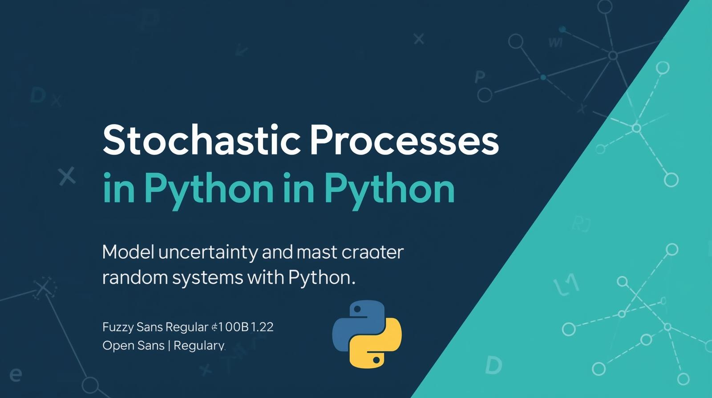

# Curso de Procesos Estocásticos en Python
¿Te ha interesado alguna vez  modelar fenómenos como el clima, el tráfico o el comportamiento del mercado financiero? Estos fenomenos si lo observas detenidamente, parecen tener un comportamiento poco predecible, mejor dicho parecen impredecible  u aleatorio. ¿Pero sabias que estos procesos aleatorios se pueden modelar? Esto es posible gracias a los procesos estocásticos, que son herramientas matemáticas que nos permiten analizar y predecir el comportamiento de sistemas que evolucionan de manera aleatoria a lo largo del tiempo.

Este curso te introduce a los fundamentos de los procesos estocásticos utilizando Python, una de las herramientas más populares en ciencia de datos y análisis estadístico. A lo largo del curso, aprenderás a implementar modelos estocásticos, simular procesos aleatorios y aplicar estos conceptos a problemas del mundo real.
# Objetivos
## Objetivo General
Desarrollar la capacidad de modelar, analizar y simular sistemas estocásticos utilizando Python, aplicando los fundamentos de la teoría de probabilidades, cadenas de Markov y teoría de colas en contextos reales de ingeniería, datos y sistemas.
## Objetivos Específicos
- Comprender los fundamentos de los procesos estocásticos, su clasificación, propiedades y aplicaciones en distintos dominios (finanzas, transporte, producción, servicios, entre otros).

- Analizar y simular cadenas de Markov en tiempo discreto y continuo, identificando su estructura, estados recurrentes, absorbentes y ergódicos, así como su distribución estacionaria.

- Implementar simulaciones de procesos de Markov con Python, construyendo y visualizando matrices de transición, trayectorias de estados y grafos de transición.

- Aplicar la teoría de colas para modelar sistemas de servicio, evaluando métricas de desempeño como número promedio de clientes en el sistema, tiempo de espera y utilización del servidor.

- Modelar y analizar sistemas de colas de un solo servidor, múltiples servidores y redes de colas (modelos de Jackson) mediante simulaciones computacionales y análisis de equilibrio.

- Interpretar los resultados obtenidos a partir de modelos estocásticos, relacionándolos con problemas reales y formulando estrategias de optimización o mejora en procesos productivos o de servicios.
# Contenido del repositorio
Este repositorio contiene material didáctico, ejemplos prácticos y proyectos en Python para el estudio de Procesos Estocásticos. Está orientado a estudiantes y profesionales de áreas como estadística, matemáticas aplicadas, ingeniería e inteligencia artificial que deseen comprender y aplicar herramientas de probabilidad y simulación en la modelación de sistemas aleatorios.

El curso combina teoría y práctica, cubriendo desde cadenas de Markov hasta procesos continuos, con ejemplos implementados en NumPy, pandas y matplotlib.
## 📑 Módulos del curso

1. Introducción a procesos estocásticos

2. Cadenas de Markov en tiempo discreto

3. Aplicaciones de cadenas de Markov en Tiempo Discreto
4. Cadenas de Markov en tiempo continuo
5. Teoría de colas: Fundamentos y Modelos de un Servidor (M/M/1)
6. Sistemas con Múltiples Servidores y Modelos M/M/c
7. Redes de Colas y Modelos Avanzados
8. Aplicaciones en Machine Learning y Proyecto integrador
## 📂 Estructura del repositorio
- `notebooks/`: Contiene notebooks de Jupyter con explicaciones teóricas y ejemplos prácticos.
- `data/`: Conjuntos de datos utilizados en los ejemplos y proyectos.
- `scripts/`: Scripts de Python para simulaciones y análisis.
- `Projects/`: Proyectos integradores que aplican los conceptos aprendidos.
- `README.md`: Descripción del curso y estructura del repositorio.
- `requirements.txt`: Lista de dependencias necesarias para ejecutar el código.

📺 **Sígueme en YouTube:** [[link](https://www.youtube.com/@skillscodepro/videos)]  
📝 **Lee los artículos en Medium:** [[link](https://medium.com/@kevin_sossav)]  
💬 **Conecta en LinkedIn:** [[link](https://www.linkedin.com/in/kevinandressossavalencia)]  